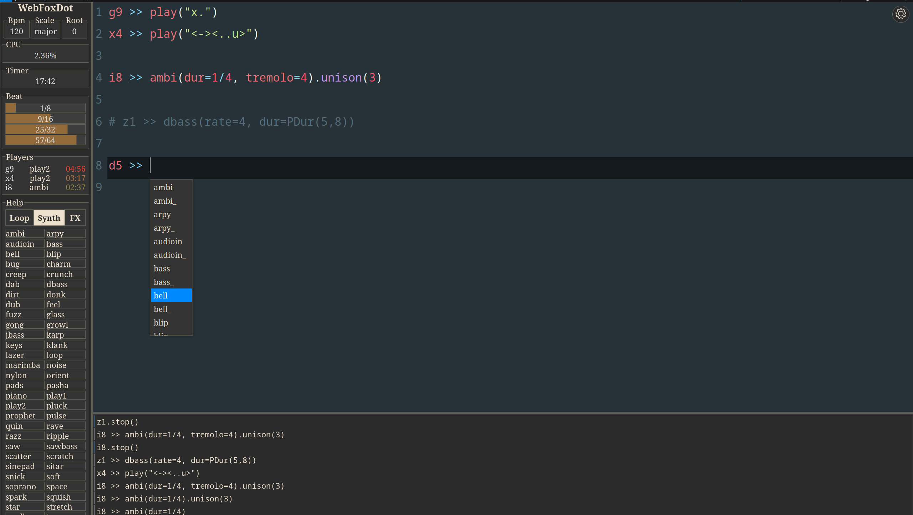

# WebFoxDot

WebFoxDot is a web-based interface for the FoxDot or Renardo live coding music environment. It allows you to write and send code to a local FoxDot or Renardo program running on your computer.

> [!Note]
> WebFoxDoT IS NOT a full web-based version of FoxDot or Renardo. You still need to have FoxDot or Renardo installed on your computer to use WebFoxDot.

## 👀 How does it look?



## 🤔 Why WebFoxDot?
We first made WebTroop to replace the old Troop interface, we did it our way so that it was effective and reliable live. As the work was already done, we decided to make a WebFoxDot interface for the live coding community, something more generic that anyone can use. We know that there are already some people using IDEs like Pulsar or Vim with FoxDot, but we wanted to make something more user-friendly, more visual and focus on the live aspect of FoxDot. 

## 🚩 Known issues
- WebFoxDot is not working with Chrome or other Chromium based browser (Vivaldi, Edge, Brave, Opera, ... ), some shortcuts are not recognized
- Not tested yet on Safari or other web browsers
- Some shortcuts may not 

## ✅ Requirements
- a fully working FoxDot or Renardo installation
- a working SuperCollider installation
- a modern web browser (for now it works only with Firefox)
- the websocket package for Python (install it with `pip install websockets`)

## ✨ Features
- a code editor with syntax highlighting
- a beautiful and responsive interface with resizable panel and console logs
- change font family, code font size and interface font size 
- change the code theme with dozens of themes available
- a console log to see the output of foxdot with the last item appended at the top
- a panel to see all relevant information (Bpm, Scale, Root, Cpu usage, Timer, the current beat modulo, a list of active players and a list of available Loops, Synths, and Fx)
- show the list of active players with their id, name of synth or loop, time of activity (with color based on elapsed time).
- the ability to stop a player by clicking on the list.
- show the solo players with a different color
- a piano roll based on the actual scale and root and the ability to insert note in the editor by clicking on it (`Alt-P` or click on `Root` to enable/disable the piano roll)
- a auto-completion feature with the ability to insert new random player, list of synth, list of fx, list of loop and a lot more.
- comment and stop/start a player with just `Alt-x`
- and a lot more to come...


## 🐍 Installation with Python

### Clone the repository and go to the directory:
```bash
git clone git@github.com:CrashServer/webFoxDot.git
cd webFoxDot
```

### Rename the config file and edit the foxdot path:
```bash
cp config.py.sample config.py
nano config.py

Change the FOXDOT_PATH to your foxdot path
```

### Copy the content of this startup.py file to your FoxDot startup file:
```text
Your startup file is located in the FoxDot directory:
/FoxDot/lib/Custom/startup.py
```

### Run Foxdot with a server:
```python
python server.py
```

> [!WARNING]
> You don't need to run FoxDot manually, the server will start FoxDot for you. 
> Also, make sure you have something like this 3 lines printed in your terminal, if not restart from the beginning:
> ```python
> FoxDot started, pid: 79311
> WebSocket server started on port 1234
> Start FoxDot WebSocket server at ws://localhost:20000
> ```

### Start a http server to serve the web interface:
```python
cd dist
python -m http.server
```

> [!WARNING] 
> Make sure that your running the server in the `dist` directory because it's a compiled version of the web interface. For running in development mode, see the `Installation with Node.js` section.

### Open your browser and go to `http://localhost:8000`

## 📉 Sending the CPU usage to the web interface

If you want to send the Supercollider CPU usage to the web interface, follow these steps and go for a crash server (notice how the interface reacts to server load): 

In the SuperCollider IDE, run the following code:
```supercollider
b = NetAddr.new("localhost", 20000); 

(
r = Routine {
	loop {
		b.sendMsg("/CPU", round(s.peakCPU,0.01));
	1.yield;
	};
}.play();
)

You can stop this routine with: 
r.stop()
```

## 🟩 Installation with Node.js
If you want to run the web interface in development mode, you need to have Node.js installed on your computer.

### Clone the repository and go to the directory:
```bash
git clone git@github.com:CrashServer/webFoxDot.git
cd webFoxDot
```

### Rename the config file and edit the foxdot path:
```bash
cp config.js.sample config.js
nano config.js

Change the FOXDOT_PATH to your foxdot path
```

### Copy the content of this startup.py file to your FoxDot startup file:
```text
Your startup file is located in the FoxDot directory:
/FoxDot/lib/Custom/startup.py
```

### Run the FoxDot server:
```python
python server.py
```

> [!WARNING]
> You don't need to run FoxDot manually, the server will start FoxDot for you. 
> Also, make sure you have something like this 3 lines printed in your terminal, if not restart from the beginning:
> ```python
> FoxDot started, pid: 79311
> WebSocket server started on port 1234
> Start FoxDot WebSocket server at ws://localhost:20000
> ```

### Start a http server to serve the web interface:
```js
npm install
npm run dev
```

### Open your browser and go to `http://localhost:3000`

## 🚀 Usage
All things that work in FoxDot or Renardo will work in WebFoxDot. 

- evaluate a line of code with `Ctrl-Enter`
- evaluate a block of code with `Ctrl-Alt-Enter`
- stop all players with `Ctrl-;'
- auto-completion with `Ctrl-Space`
- comment a line and stop a player with `Alt-x`
- you can comment and stop a block with `Ctrl-Alt-x`
- show the piano roll with `Alt-P`
- solo a player with `Alt-S`
- unsolo all players with `Ctrl-Alt-S`
- increment a value with `Alt-=`
- decrement a value with `Ctrl-Alt-=`

And many more to discover, a full list of shortcuts is available in the config panel.

## 🗺️ Roadmap
- [ ] Add more interface themes
- [ ] Add a vim mode
- [ ] a clear console button

## 📝 License

Copyright © 2025 [CrashServer](https://github.com/CrashServer).

This project is MIT licensed.